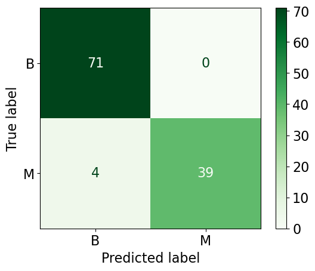

# Derin-Ogrenme
Derin Öğrenme Dersi Uygulamaları

```python
import pandas as pd
df = pd.read_csv('data - data.csv')
df = df.drop('id', axis=1)

```


<div>
<table border="1" class="dataframe">
  <thead>
    <tr style="text-align: right;">
      <th></th>
      <th>diagnosis</th>
      <th>radius_mean</th>
      <th>texture_mean</th>
      <th>perimeter_mean</th>
      <th>area_mean</th>
      <th>smoothness_mean</th>
      <th>compactness_mean</th>
      <th>concavity_mean</th>
      <th>concave points_mean</th>
      <th>symmetry_mean</th>
      <th>...</th>
      <th>radius_worst</th>
      <th>texture_worst</th>
      <th>perimeter_worst</th>
      <th>area_worst</th>
      <th>smoothness_worst</th>
      <th>compactness_worst</th>
      <th>concavity_worst</th>
      <th>concave points_worst</th>
      <th>symmetry_worst</th>
      <th>fractal_dimension_worst</th>
    </tr>
  </thead>
  <tbody>
    <tr>
      <th>0</th>
      <td>M</td>
      <td>17.99</td>
      <td>10.38</td>
      <td>122.80</td>
      <td>1001.0</td>
      <td>1.184</td>
      <td>2.776</td>
      <td>3.001</td>
      <td>1.471</td>
      <td>2.419</td>
      <td>...</td>
      <td>25.38</td>
      <td>17.33</td>
      <td>184.60</td>
      <td>2019.0</td>
      <td>1.622</td>
      <td>6.656</td>
      <td>7.119</td>
      <td>2.654</td>
      <td>4.601</td>
      <td>1.189</td>
    </tr>
    <tr>
      <th>1</th>
      <td>M</td>
      <td>20.57</td>
      <td>17.77</td>
      <td>132.90</td>
      <td>1326.0</td>
      <td>8.474</td>
      <td>7.864</td>
      <td>869.000</td>
      <td>7.017</td>
      <td>1.812</td>
      <td>...</td>
      <td>24.99</td>
      <td>23.41</td>
      <td>158.80</td>
      <td>1956.0</td>
      <td>1.238</td>
      <td>1.866</td>
      <td>2.416</td>
      <td>186.000</td>
      <td>275.000</td>
      <td>8.902</td>
    </tr>
    <tr>
      <th>2</th>
      <td>M</td>
      <td>19.69</td>
      <td>21.25</td>
      <td>130.00</td>
      <td>1203.0</td>
      <td>1.096</td>
      <td>1.599</td>
      <td>1.974</td>
      <td>1.279</td>
      <td>2.069</td>
      <td>...</td>
      <td>23.57</td>
      <td>25.53</td>
      <td>152.50</td>
      <td>1709.0</td>
      <td>1.444</td>
      <td>4.245</td>
      <td>4.504</td>
      <td>243.000</td>
      <td>3.613</td>
      <td>8.758</td>
    </tr>
    <tr>
      <th>3</th>
      <td>M</td>
      <td>11.42</td>
      <td>20.38</td>
      <td>77.58</td>
      <td>386.1</td>
      <td>1.425</td>
      <td>2.839</td>
      <td>2.414</td>
      <td>1.052</td>
      <td>2.597</td>
      <td>...</td>
      <td>14.91</td>
      <td>26.50</td>
      <td>98.87</td>
      <td>567.7</td>
      <td>2.098</td>
      <td>8.663</td>
      <td>6.869</td>
      <td>2.575</td>
      <td>6.638</td>
      <td>173.000</td>
    </tr>
    <tr>
      <th>4</th>
      <td>M</td>
      <td>20.29</td>
      <td>14.34</td>
      <td>135.10</td>
      <td>1297.0</td>
      <td>1.003</td>
      <td>1.328</td>
      <td>198.000</td>
      <td>1.043</td>
      <td>1.809</td>
      <td>...</td>
      <td>22.54</td>
      <td>16.67</td>
      <td>152.20</td>
      <td>1575.0</td>
      <td>1.374</td>
      <td>205.000</td>
      <td>0.400</td>
      <td>1.625</td>
      <td>2.364</td>
      <td>7.678</td>
    </tr>
  </tbody>
</table>
<p>5 rows × 31 columns</p>
</div>


```python
from sklearn.model_selection import train_test_split
from sklearn.ensemble import RandomForestClassifier
from sklearn.metrics import accuracy_score, precision_score, recall_score, f1_score

# Eğitim ve test için veriyi ayırma
X_train, X_test, y_train, y_test = train_test_split(df.drop('diagnosis', axis=1), df['diagnosis'], test_size=0.2, random_state=42)

# Random Forest
ran_for = RandomForestClassifier()
ran_for.fit(X_train, y_train)

# Tahmin
y_pred = ran_for.predict(X_test)

# Modeli Değerlendirme
accuracy = accuracy_score(y_test, y_pred)
precision = precision_score(y_test, y_pred, pos_label='B')
recall = recall_score(y_test, y_pred, pos_label='B')
f1 = f1_score(y_test, y_pred, pos_label='B')


print(f"Random Forest Accuracy: {accuracy:.4f}")
print(f"Random Forest Precision: {precision:.4f}")
print(f"Random Forest Recall: {recall:.4f}")
print(f"Random Forest f1: {f1:.4f}")
```

    Random Forest Accuracy: 0.9649
    Random Forest Precision: 0.9467
    Random Forest Recall: 1.0000
    Random Forest f1: 0.9726
    


```python
import matplotlib.pyplot as plt
from sklearn.metrics import confusion_matrix, ConfusionMatrixDisplay

cm1 = confusion_matrix(y_test,y_pred)


#Confusion Matrix Isı Haritası
plt.figure(figsize=(6,4))
plt.rcParams.update({'font.size': 16})
disp = ConfusionMatrixDisplay(confusion_matrix=cm1, display_labels=ran_for.classes_)
disp.plot(cmap='Greens')
```


    <sklearn.metrics._plot.confusion_matrix.ConfusionMatrixDisplay at 0x1c5508cd280>


    <Figure size 600x400 with 0 Axes>


    

    


```python

```

